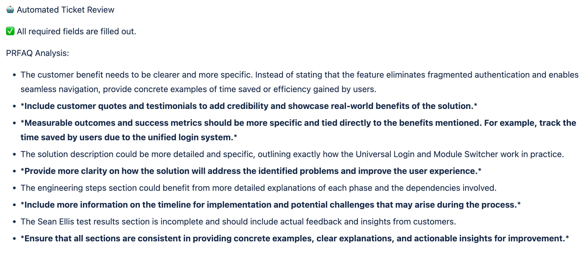

# PM Coach

## Summary
The PM coach is a webhook based agent that helps PMs with their Jira tickets. It uses OpenAI to generate evaluations of the PRFAQ documents BetterCloud PMs attach to Jira tickets. It will ensure that specific fields are filled out and provide guidance to the PM on how to improve their PRFAQ document. Many of the settings are hardcoded for BetterCloud's Jira instance, but it should be easy to modify for other Jira instances.



## Requirements
- Python 3.8 or higher
- pip (Python package installer)

## Setup
1. Clone the repository
   ```bash
   git clone https://github.com/yourusername/yourproject.git
   cd yourproject
   ```

   Make sure to modify your .env file with your Jira info and OpenAI API keys.
   ```bash
   cp .env.example .env
   ```

1. Create API keys and webhooks
   - Jira webhook (see [Jira docs](https://developer.atlassian.com/server/jira/platform/webhooks/)). You'll likely need to be a Jira administrator. 
   - OpenAI API key (see [OpenAI docs](https://platform.openai.com/docs/quickstart))

1. Install required dependencies
   Locally:
   ```bash
   pip install -r requirements.txt
   ```

   Docker:
   ```bash
   docker build -t pm-coach .
   ```

1. Run the application
   Locally:
   ```bash
   fastapp run app.py
   ```

   Or if using Docker: 
   ```bash
   docker run -e JIRA_SERVER="" \
           -e JIRA_EMAIL="" \
           -e JIRA_API_TOKEN="" \
           -e WEBHOOK_SECRET="" \
           -e OPENAI_API_KEY="" \
           pm-coach
   ```